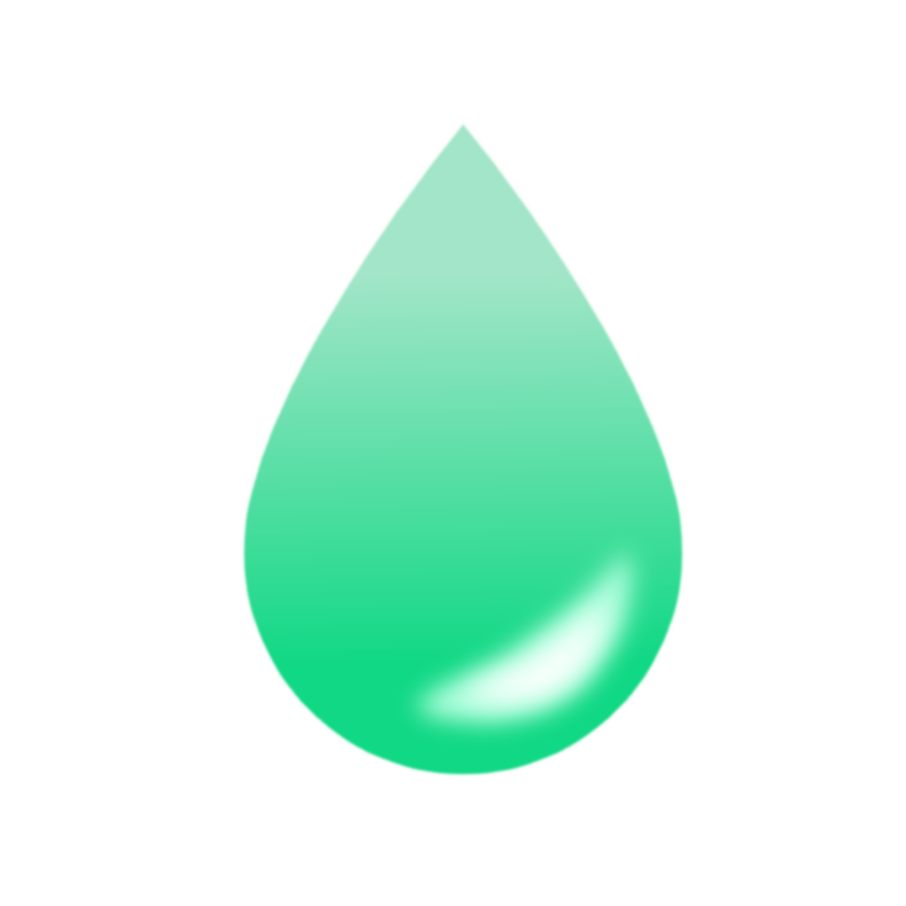
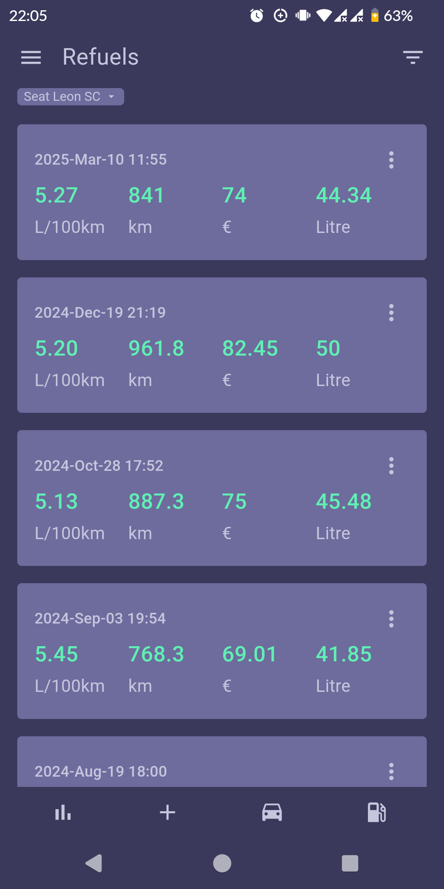
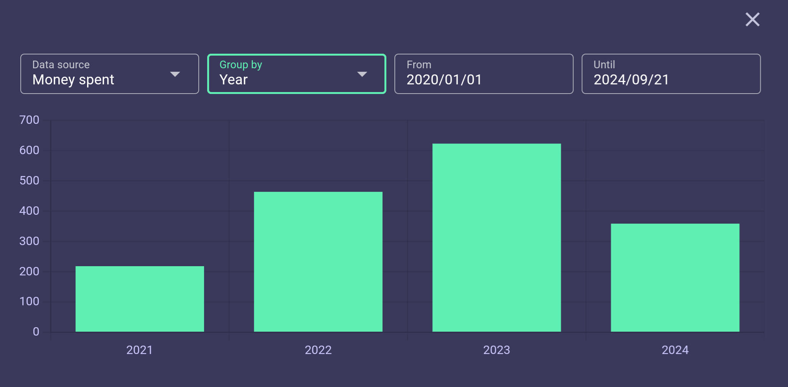

[![CI/CD][ci-img]][ci-url]
[![Issues][issue-img]][issue-url]

<br />

<div align="center" style="display: flex; justify-content: center; align-items: center;">
  <a href="https://github.com/MatiasG19/refuel-tracker">
    
  </a>
</div>

<h3 align="center" style="display: flex; justify-content: center; align-items: center;">Refuel Tracker</h3>

<div align="center" style="display: flex; justify-content: center; align-items: center;">
  <p>Tracks your refuels and displays your data in nice graphs.</p>
</div>

<div align="center" style="display: flex; justify-content: center; align-items: center;">
  <p>
    <a href="https://github.com/MatiasG19/refuel-tracker/releases">Download APK</a>
    ·
    <a href="https://github.com/MatiasG19/refuel-tracker/issues">Report bug</a>
    ·
    <a href="https://github.com/MatiasG19/refuel-tracker/issues">Request feature</a>
  </p>
</div>

<div align="center" style="display: flex; justify-content: center; align-items: center;">
  <p>
    <a href="https://play.google.com/store/apps/details?id=capacitor.quasar.refueltracker&pcampaignid=pcampaignidMKT-Other-global-all-co-prtnr-py-PartBadge-Mar2515-1"></a>
    <a href="https://github.com/ImranR98/Obtainium"></a>
  </p>
</div>

<div align="center" style="display: flex; justify-content: center; align-items: center;">
 <p>
    
    
    
  </p>
</div>
<div align="center" style="display: flex; justify-content: center; align-items: center;">
  <p>
      
  </p>
</div>

## Features

- Easy to use interface with quick bottom navigation
- Track multiple vehicles
- Support for different fuel consumption units
- See your fuel consumption for each refuel
- Display all your data in nice graphs
- View and edit your refuels or add past ones
- Backup data in text format
- Dark and Light themes

## Languages

- English
- German

## Getting started

### Prerequisits

- NodeJS
- Android Studio

### Start

Install dependencies

```bash
npm install
```

Start in browser

```bash
npm run dev
```

Start in Android Studio

```bash
npm run appdev
```

Create apk

```bash
npm run appbuild
```

## Contribute

Check out the [contribution guide](.docs/Contribute.md).

[ci-img]: https://github.com/MatiasG19/refuel-tracker/actions/workflows/cicd.yml/badge.svg?branch=main
[ci-url]: https://github.com/MatiasG19/refuel-tracker/actions/workflows/cicd.yml
[issue-img]: https://img.shields.io/github/issues/MatiasG19/refuel-tracker
[issue-url]: https://github.com/MatiasG19/refuel-tracker/issues
